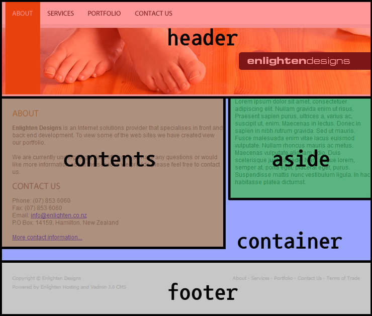

# 그룹화 섹셔닝

그룹화 작업을 div로 함.

네이버 널리의 코딩 컨벤션 PDF 파일읠 66페이지 참고
https://nuli.navercorp.com/upload/2020/6672a2b7-abdd-411e-8a50-362911bc7999_Coding_Conventions_for_Markup.pdf

이름을 지정할때는 id, class를 이용해서 한다
중요한 부분, 큰 영역은 id
다소 중요하지 않은 부분, 작은 영역은 class
id는 링크의 목적지
