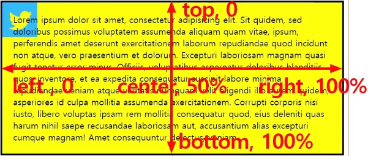

# 배경
배경 그림을 지정하는 방법
색상, 이미지가 방법임
border를 설정할때 색상을 넣지 않아도 표시가 되는데 이때 색상은 글자색과 같음.


## background
배경색을 지정하면 padding을 설정한 부분에도 배경색이 표시된다.

backgound 처럼 -이 붙지 않은것과 background-color 처럼 - 이 붙은 속성이 있으면
없는걸 먼저 써야 한다.   
나중에 쓰면 앞의 설정을 모두 무시하고 설정된다.

### case 1
```
background-color: lime;
background-image : url(img/twt.png);
```
아이콘에 라임색이 표시됨

### case 2
```
background-color: lime;
background : url(img/twt.png);
```
아이콘에 하얀색이 색상으로 적용되어 있음.  
background 속성이 background-color 속성을 덮어씀.  
background: url(); 로 씌여 있지만 기본 색상이 적용되어 있는것임.  
backgournd: 기본색상 url();  

### repeat
그림이 있는 경우 반복을 지정할수 있음.  
repeat가 기본임.  
repeat | no-repeat | repeat-x | repeat-y

### background-position
첫번재 값은 가로, 두번째 값은 세로  
두가지 기준방향으로 봐야함.  
가로방향, 세로방향임  



가로 방향일때  
왼쪽 방향을 left 임  
가운데 방향이 center 임  
오른쪽 방향을 right 임  

세로 방향일때  
상단 방향을 top  
가운데 방향을 center  
바닥 방향을 bottom  
기본은 left top 임  
center center는 center만 써도 됨

#### 수치로도 표시 가능  
```
left => 0  
center => 50  
right ->100

top => 0  
center => 50  
bottom => 100  
```

#### 픽셀로 설정
```
background-position: 20px 50%  
```
가로 방향 20px 띄워서 나오게 함.  
가로방향은 왼쪽에서 20px 띄워서 표시하고  
세로 방향은 중간으로 표시함.  
```
background-position: -20px 50%  
```
왼쪽이 바깥으로 20px 나가서 표시함.  

### background-attachment
스크롤바가 나오게 하고  
스크롤바가 나오는 위치에 배경이 나오도록 하겠음.  
```
background:  url(img/twt.png) no-repeat 90% 20px;
```
로 설정하면
화면의 90% 지점과 이미지의 90% 되는 지점이 일치되도록 설정됨
그림은 스크롤따라서 움직이게 됨.

```
background-attachment: fixed 
```
처리하면 이미지가 고정되어서 스크롤해도 그 자리에 남아있음.  
여러개의 값을 쓸때는 항상 띄워쓰기를 해야함.  

### background-size
CSS3 속성  
하나의 영역에 배경을 줄때 영역과 이미지의 크기가 다를경우 원하대로 표시가 안됨.  
때문에 background-size 속성을 줘서 표시함.  

```
background-size: 100% 100% 
```
인 경우 가로 세로 모두 100%로 표시가 되나  
비율이 맞지 않은 경우 찌그러져 보임.  
이때 어느 한쪽을 기준으로 모두 표시되고 나머지는 비율에 맞게 짤리게 하려면  
```
backgournd-size: 100% auto;
```
로 설정하면 됨.  
반대도 가능.  
 
#### 편하게 쓸때
어느쪽을 맞추는게 나을지 모르는 경우
어느 한쪽을 꽉 채우고 나머지 쪽은 잘려 나가게 하려면
backgournd-size: cover 처리

### background-clip
CSS3
그림을 넣었는데 padding은 제외하고 content 배경에만 표시하고 싶은 경우
```
background-clip: content-box
```
로 설정함

### background-origin
CSS3 임
origin은 기준점을 생각하면 됨.  
padding 쪽에 그림이 표시되는 것이 없음.  
content를 이미지 영역의 기준점으로 생각함.  
background-clip은 content를 감싸는 요소를 시작점으로 삼음.  
그래서 이미지도 왼쪽 제일 위를 기준으로 잡고 padding에 해당하는 부분은 감추는 식임.  
origin은 content의 시작을 기준으로 삼음.  

```
<style>
.box2 {
        /*background-size:  100% auto;*/
        /*background-size:  auto 100%;*/
        background-size:  cover;
        background-clip: content-box;
        background-origin: content-box ;
    }
</style>
```