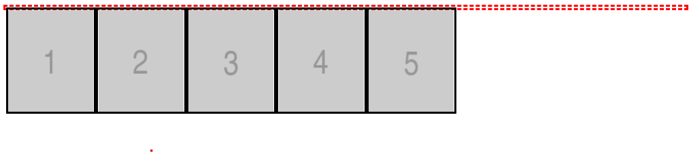

# 플롯 해지


## 되새김

### 가운데 정렬
```
.area {
    width:  800px;
    margin:  0 auto;
}
```
width 800을 가운데 정렬함

### 이미지 하단 간격 제거
```
<style>
img{
    vertical-align: top;
}
</style>
```

이미지를 div로 감싸면 영역의 하단이 강제로 생기는데  
이 간격을 없애 줘야함.


## 플롯 해제

### 일반적인 방법
```
<style>
.cls {
    clear: both;
}
</style>
```
이전 요소에 float가 설정되어 있는 경우  
이 float를 해제하고 싶을때 clear를 사용함.  
이때 clear 속성의 값은 이전에 float에 설정된 값과 일치하거나  
float:both로 설정해야 해제가 됨.  

### 오작동 예제
```
<style>
.area {
    width:  800px;
    margin:  0 auto;
    border:  3px dashed red;
}
</style>

<div class="area">
    <div class="thumb"></div>
    <div class="thumb"></div>
    <div class="thumb"></div>
    <div class="thumb"></div>
    <div class="thumb"></div>
</div>
```



빨간 점선이 이미지 영역을 감싼 형태로 나올것으로 예상되지만  
float를 설정하면 그 부분을 인식하지 못하므로 없는 것과 같이 border가 형성된다.  

### 기본 방법
때문에 clear는 float의 마지막에 부분에서 지정해 줘야 한다.  
float 대상이 되는 요소들을 감싸고 있는 상위 요소의 자식들중 제일 마지막이 그 지점이다.  
하지만 임의의 요소를 생성해서 clear를 하는것은 매끄럽지 않으므로  
공식처럼 하위와 같이 사용한다.
```
<style>
.area {
    width:  800px;
    margin:  0 auto;
    border:  3px dashed red;
}
.area:after {
    content:  '';
    display: block;
    clear:  both;
}
</style>
```

### IE 낮은 버전
IE의 낮은 버전에서는 위 스타일이 제대로 동작하지 않을수 있음.  
.area:after 의 :after를 인식하지 못한다.  
이때는 *zoom 속성을 이용해서 처리한다.  

```
<style>
.area {
    width:  800px;
    margin:  0 auto;
    border:  3px dashed red;
    *zoom: 1; /* IE6, IE7 Hack */
}
</style>
```

### overflow를 이용한 방법
```
.area {
    width:  800px;
    overflow: hidden; /* 영역에서 넘치는 부분 */
    margin:  0 auto;
    border:  3px dashed red;
    *zoom:  1;
}
		
```
내가 지정한 부분을 벗어나는(넘치는) 부분을 가리도록(지워버리도록) 처리한다.  
이렇게 하면 float으로 지정된 영역을 감싸는 효과가 있다.  
하지만 float 영역을 넣어나는데 표시가 되어야 하는 부분 역시 표시되지 않는 단점이 있다.  
일반적으로는 :after를 이용한 방법을 사용한다.