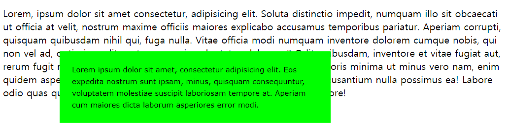
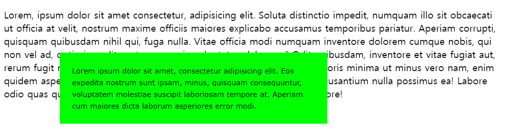

# 포지션 지정

디자인을 할때 position이 float과 더불어서 제일 많이 사용함.
p 태그를 사용하면 위아래 여백이 조금 생김


## 포지션

```
<style>
    .box {
        /* relative | absolute | fixed | static */
        position: static;
        left: 100px;
        top: 100px;
        width: 400px;
        padding:  20px;
        background-color: lime;
        font: 12px/1.6 verdana, sans-serif;
    }
</style>
```


* relative - 상대적인. 아무것도 지정 안한거랑 똑같음.  
  top, left를 주면 현재 위치를 기준으로 이동하게 됨.  
  처음 지정할때는 인식하지만,  이동하게 되면 (left top을 이용하여) 혼자 움직이게 됨.
  
* absolute - 절대적인. 해당 요소를 인지하지 못함.  
  그래서 밑의 요소가 밑으로 표시됨.  
  마치 위에 띄우는 것처럼 보여짐
  
* fixed - absolute와 똑같은 특징을 가지고 있음.
  
* static - 포지션이 지정되어 있는 요소를 지정이 되기 이전의 상태로 만들어줌
  
  

## 하위 요소가 absolute
```
<style>
.a {
    position: absolute;
    left: 0;
    top: 0;
    background-color: rgba(255, 0, 0, 0.8);
}
.b {
    position: absolute;
    left: 50px;
    top:  50px;
    background-color: rgba(0, 255, 0, 0.8);
}
.c {
    position: absolute;
    left: 100px;
    top: 100px;
    background-color: rgba(0, 0, 255, 0.8);
}
</style>
```
 

z-index는 수치가 큰 것이 앞으로 나옴

absolute는 기준이 항상 끝이 아니고 바깥 부분의 위치에 따라 계산된다.

바깥 부분이 감싸지는 못하지만 위치를 계산하는 기준은 된다.
 

```
<style>
.area {
    border: 5px dashed red;
    width:  800px;
    margin: 0 auto;
    position: relative;
}
</style>
```
 

바깥요소의 position을 relative로 설정하고 (기준이 되는 요소)
특정위치에 고정하는 부분은 absolute로 설정한다.
=> 기준은 relative, 고정은 absolute

만약 바깥 요소를 absolute로 지정하면 margin: 0 auto;(가운데로 표시되게 하는 스타일)이 적용되지 않는다.
물론 기준은 될수 있지만 가운데 정렬, 현재 레이아웃을 유지하는 특성이 없어지므로 거의 사용하지 않음.

## 하위 요소가 fixed 
바깥에 relative 가 있어도 기준이 되지 않음.
무조건 끝부분 부터 계산함.
 
B,C는 absolute로 되어 있어 상위 relative를 기준으로 계산
fixed의 특징은 무조건 고정위치  
가장 바깥쪽을 기준으로 계산함.


relative는 현재 위치를 기준오르 얼마만큼 이동한다를 만들때
position:absolute의 기준을 만들때 사용

absolute는 절대적인 위치를 지정할때 사용
제일 끝에서 부터 얼마만큼 띄우는것을 지정할때
바깥에 감싸고 있는 position:relative를 기준으로 어떤 위치를 지정할때

사이틑 만들때 가장 아래에 있는 위로가기 버튼같을것들을 만들때 fixed를 많이 사용함
```
<style>
.area {
    position: relative;
    width:  800px;
    margin: 0 auto;
    border: 5px dashed red;
}
.a {
    position: relative;

    
    background-color: rgba(255, 0, 0, 0.8);
}
.b {
    position: relative;
    left: 50px;
    margin-top: -200px;
    background-color: rgba(0, 255, 0, 0.8);
}
.c {
    position: relative;
    left: 100px;
    margin-top: -200px;
    background-color: rgba(0, 0, 255, 0.8);
}
</style>
```

margin을 이용해서 움직이면 그 다음 content는 따라가게 됨